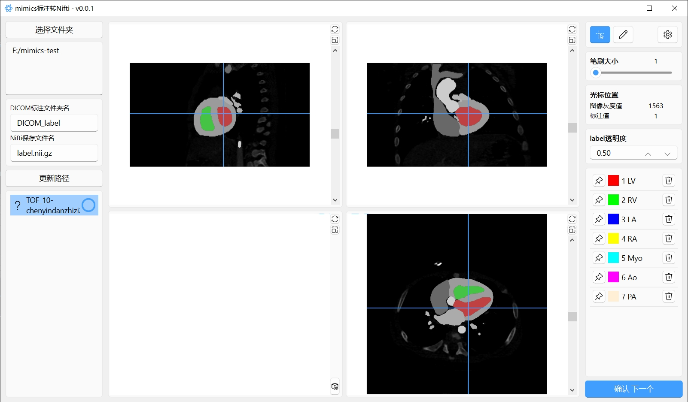

# Mimics label to Nii

批量将mimics导出的DICOM标注转Nifti(.nii.gz)格式

## 数据目录格式
需要按图像整理子文件夹，每个子文件下存放此图像的DICOM序列文件夹，生成的Nifti标签也会在相应子文件下:
- 总文件夹
  - 子文件夹1
  - 子文件夹2
  - 子文件夹3
    - label_DICOM (DICOM序列文件夹)
      - IM0
      - IM1
      - ...
  - 子文件夹4
  - 子文件夹5

其中DICOM序列文件夹名称和Nifti保存的文件名称都可以在软件中设置，但必须所有子文件夹 __保持统一__

## 操作
- 光标模式下，点击鼠标移动光标，点击右侧按钮或直接按键盘相应数字键设定label，将会把图像中所有与光标选择的位置的灰度值相同的像素设为相应的label
- 修改模式下，逐像素修改标注



## 自定义label设置
点击右上角设置按钮，修改打开目录中的config.json中的label_names,修改完后需要重新启动

例： { 标签值 : 名称 }
``` json
"label_names": {
    "1": "LV",
    "2": "RV",
    "3": "LA",
    "4": "RA",
    "5": "Myo",
    "6": "Ao",
    "7": "PA"
}
```


